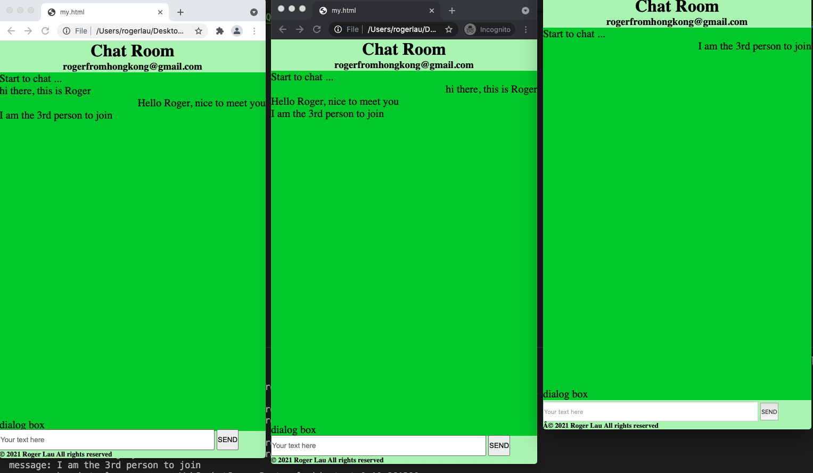

# WebSocket
Allow clients to receive message from one another

1. running the app.py script

2. open the client1.html and client2.html in browser and see the effect through console. 

WebSocket is a protocol providing full-duplex communication channels over a single TCP connection. Where as, HTTP providing half-duplex communication.

Information exchange mode of WebSocket is bidirectional. Means, server can push information to the client (which does not allow direct HTTP).

## Demo

## Summary:
1. solve the problem of one-way communication between client and server sides by using HTTP

2. two directions, this means server could take initiative to send new data to clients rather than using polling from client to check if there is new data from server side.

3. websocket could connect for long time, avoid HTTP header since every http request need to have headers.

4. Limitations

In real world, client and server's communication might go through many routers and firewalls, and some rule is set if there is communication then the connection is forced to be disconnected by these rules and without notify client or server sides. This result in client or server sides think they are still connected to each other.  

Solution: 
client and server sides use Ping/Pong Frame（RFC 6455 - The WebSocket Protocol) by sending data between one another so as to let those firewall, routers know they are having communication.
